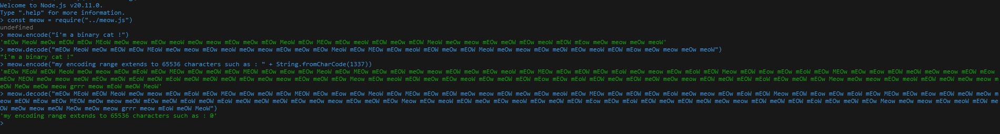

<h1 align="center">Meow Encoding</h1>

<p align="center">
  
  
  
</p>

<p align="center">
    a simple library I made on the spur of the moment just for fun that lets you encode and decode a message for cats
</p>

## Table of contents
- [About](#about)
- [Pictures](#pictures)
- [Installation](#installation)
- [Usage](#usage)
- [Contribute](#contribute)
- [License](#license)

## About
This project is designed for fun and for real cats! It was developed in JavaScript with NodeJS

This encoding works as follows: 
* retrieves the message to be encoded
* converts each character of this message into binary 
* set them to 8 bits or 16 bits depending on the character (if it's an ASCII character it will be 8 bits, if it's a unicode character it will be 16 bits)
* encodes each bit, if it is a 0 it will be a lowercase meow letter, if it is a 1 it will be an uppercase meow letter

example of encoding the letter "a" :
* converts "a" to binary : 1100001
* sets 1100001 to 8 bits : 01100001
* encodes each bit : mEOw meoW

## Pictures

<p align="center">
  
</p>

## Installation
* run `npm install meowmeow`

## Usage:
```js
/* import the library */
const meow = require("meowmeow");

const message = "i'm a binary cat !";

/* encode the message */
const encoded = meow.encode(message);

/* decode the encoded message */
const decoded = meow.decode(encoded);


console.log(encoded);
// mEOw MeoW meOw mEOW mEOw MEoW meOw meow mEOw meoW meOw meow mEOw meOw mEOw MeoW mEOw MEOw mEOw meoW mEOW meOw mEOW MeoW meOw meow mEOw meOW mEOw meoW mEOW mEow meOw meow meOw meoW
console.log(decoded);
// i'm a binary cat !
```

## Contribute
Contributions are welcome! Follow these steps to contribute to this project:
1. Fork the project.
2. Create a branch: `git checkout -b feature/NewFeature`.
3. Make the necessary changes and commit: `git commit -am 'Add new feature'`.
4. Push to branch: `git push origin feature/NewFeature`
5. Submit a pull request.

## License
This project is licensed under the MIT licence. See the [LICENSE](LICENSE) file for more details.

## Contact
Yvain Ramora - yvain@mailfence.com